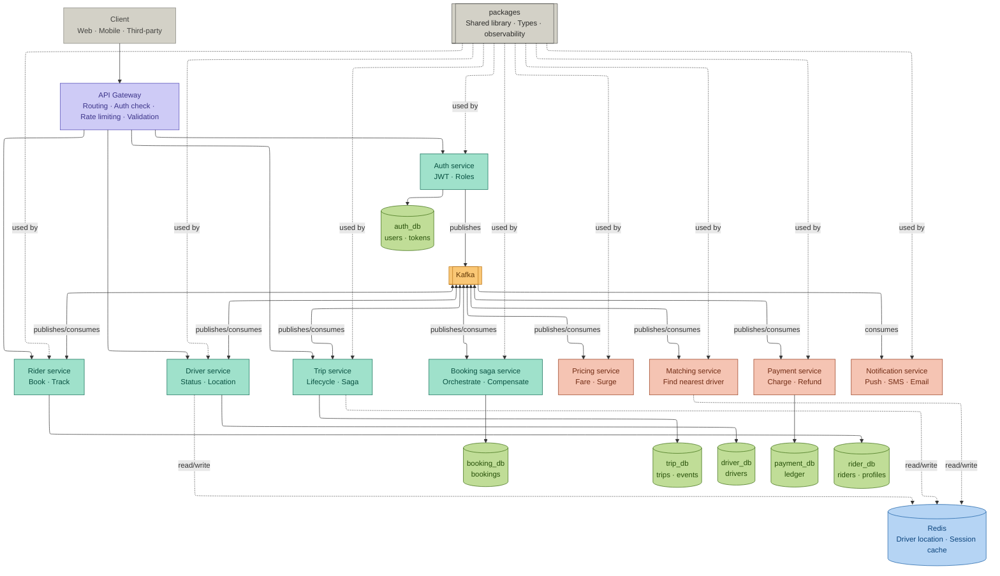
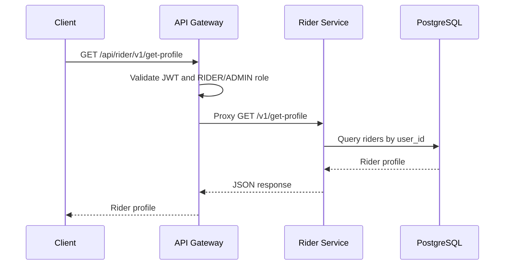
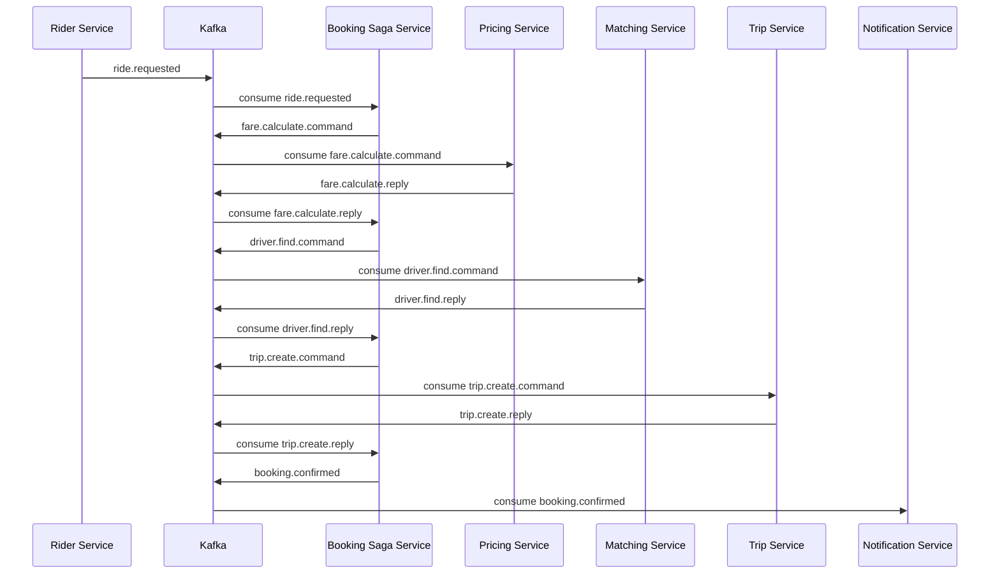
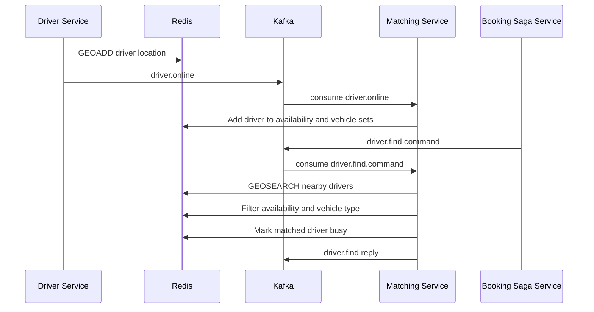
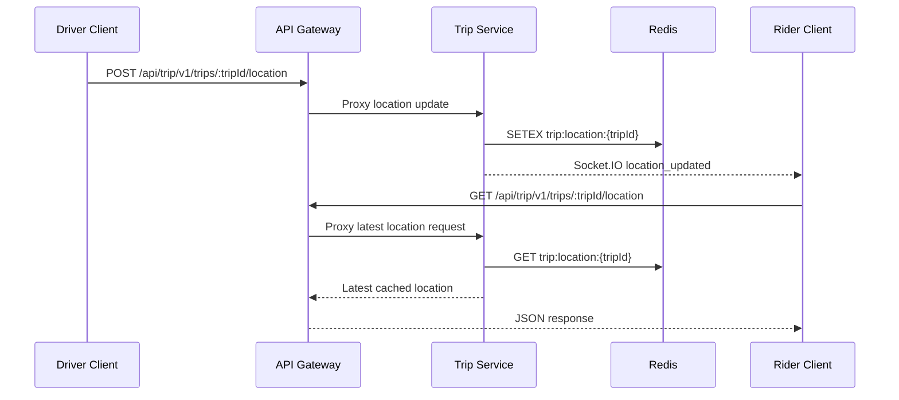
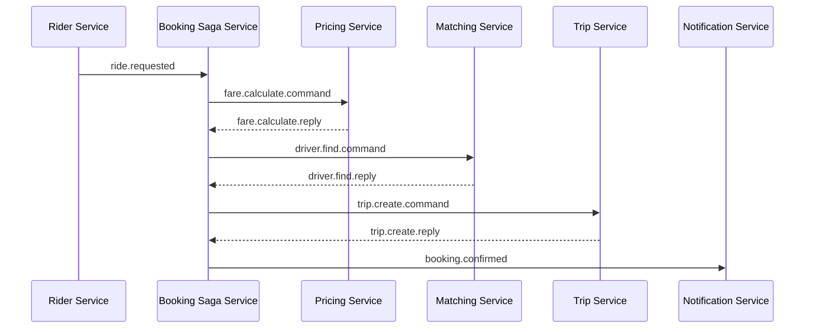

# Architecture Overview

## Table of Contents

- [System Architecture](#system-architecture)
- [Infrastructure Diagram](#infrastructure-diagram)
- [Microservices Overview](#microservices-overview)
- [Communication Patterns](#communication-patterns)
- [Design Patterns](#design-patterns)
- [Scalability Strategy](#scalability-strategy)
- [Monitoring and Observability](#monitoring-and-observability)

## System Architecture

### Architecture Diagram



The cab booking platform is organized as a microservices system behind an ingress controller and API gateway. User-facing clients call the gateway, which routes requests to domain services. Services own their data stores and exchange business events through Kafka.

## Infrastructure Diagram

The local infrastructure is defined by `docker-compose.yml` for application services and `docker-compose.kafka-redis.yml` for Kafka, Redis, Prometheus, and Grafana. All containers are attached to the external Docker network `cab_network`.

```mermaid
flowchart TB
    CLIENT["External Clients<br/>Web / Mobile / API Client"]

    subgraph HOST["Host Machine"]
        GATEWAY_PORT["localhost:4000"]
        AUTH_PORT["localhost:4001"]
        DRIVER_PORT["localhost:4002"]
        RIDER_PORT["localhost:4003"]
        TRIP_PORT["localhost:4004"]
        BOOKING_PORT["localhost:4005"]
        PRICING_PORT["localhost:4006"]
        PAYMENT_PORT["localhost:4007"]
        NOTIFICATION_PORT["localhost:4008"]
        MATCHING_PORT["localhost:4009"]
        KAFKA_PORT["localhost:9092 / 9093"]
        REDIS_PORT["localhost:6379"]
        PROMETHEUS_PORT["localhost:9090"]
        GRAFANA_PORT["localhost:3100"]
    end

    subgraph NETWORK["Docker Network: cab_network"]
        GATEWAY["gateway<br/>container: gateway<br/>port 4000"]
        AUTH["auth-service<br/>container: authentication<br/>port 4001"]
        DRIVER["driver-service<br/>container: driver-service<br/>port 4002"]
        RIDER["rider-service<br/>container: rider-service<br/>port 4003"]
        TRIP["trip-service<br/>container: trip-service<br/>port 4004"]
        BOOKING["booking-saga-service<br/>container: booking-saga<br/>port 4005"]
        PRICING["pricing-service<br/>container: pricing-service<br/>port 4006"]
        PAYMENT["payment-service<br/>container: payment-service<br/>port 4007"]
        NOTIFICATION["notification-service<br/>container: notification-service<br/>port 4008"]
        MATCHING["matching-service<br/>container: matching-service<br/>port 4009"]
        KAFKA["kafka<br/>Apache Kafka 3.9.2<br/>ports 9092 / 9093"]
        REDIS["redis<br/>Redis 8.6.2 Alpine<br/>port 6379"]
        PROMETHEUS["prometheus<br/>prom/prometheus<br/>port 9090"]
        GRAFANA["grafana<br/>grafana/grafana<br/>port 3100"]
    end

    POSTGRES[("PostgreSQL<br/>Cloud hosted via Neon<br/>Not defined in compose files")]
    GMAIL["Gmail SMTP<br/>GMAIL_USER / GMAIL_APP_PASSWORD"]
    RAZORPAY["Razorpay API<br/>RAZORPAY_KEY_ID / RAZORPAY_KEY_SECRET"]

    CLIENT --> GATEWAY_PORT --> GATEWAY

    AUTH_PORT -. host access .-> AUTH
    DRIVER_PORT -. host access .-> DRIVER
    RIDER_PORT -. host access .-> RIDER
    TRIP_PORT -. host access .-> TRIP
    BOOKING_PORT -. host access .-> BOOKING
    PRICING_PORT -. host access .-> PRICING
    PAYMENT_PORT -. host access .-> PAYMENT
    NOTIFICATION_PORT -. host access .-> NOTIFICATION
    MATCHING_PORT -. host access .-> MATCHING
    KAFKA_PORT -. host access .-> KAFKA
    REDIS_PORT -. host access .-> REDIS
    PROMETHEUS_PORT -. host access .-> PROMETHEUS
    GRAFANA_PORT -. host access .-> GRAFANA

    GATEWAY --> AUTH
    GATEWAY --> DRIVER
    GATEWAY --> RIDER
    GATEWAY --> TRIP

    AUTH <--> KAFKA
    RIDER <--> KAFKA
    DRIVER <--> KAFKA
    TRIP <--> KAFKA
    BOOKING <--> KAFKA
    PRICING <--> KAFKA
    PAYMENT <--> KAFKA
    NOTIFICATION <--> KAFKA
    MATCHING <--> KAFKA

    DRIVER <--> REDIS
    TRIP <--> REDIS
    MATCHING <--> REDIS

    AUTH --> POSTGRES
    RIDER --> POSTGRES
    DRIVER --> POSTGRES
    TRIP --> POSTGRES
    BOOKING --> POSTGRES
    PAYMENT --> POSTGRES

    PROMETHEUS -. scrapes /metrics .-> GATEWAY
    PROMETHEUS -. scrapes /metrics .-> AUTH
    PROMETHEUS -. scrapes /metrics .-> RIDER
    PROMETHEUS -. scrapes /metrics .-> DRIVER
    PROMETHEUS -. scrapes /metrics .-> TRIP
    PROMETHEUS -. scrapes /metrics .-> BOOKING
    PROMETHEUS -. scrapes /metrics .-> PRICING
    PROMETHEUS -. scrapes /metrics .-> PAYMENT
    PROMETHEUS -. scrapes /metrics .-> NOTIFICATION
    PROMETHEUS -. scrapes /metrics .-> MATCHING
    GRAFANA -. queries .-> PROMETHEUS

    NOTIFICATION --> GMAIL
    PAYMENT --> RAZORPAY
```



### Container Layout

| Container | Service | Host Port | Internal Port | Compose File |
| --- | --- | --- | --- | --- |
| `gateway` | API Gateway | `4000` | `4000` | `docker-compose.yml` |
| `authentication` | Auth Service | `4001` | `4001` | `docker-compose.yml` |
| `driver-service` | Driver Service | `4002` | `4002` | `docker-compose.yml` |
| `rider-service` | Rider Service | `4003` | `4003` | `docker-compose.yml` |
| `trip-service` | Trip Service | `4004` | `4004` | `docker-compose.yml` |
| `booking-saga` | Booking Saga Service | `4005` | `4005` | `docker-compose.yml` |
| `pricing-service` | Pricing Service | `4006` | `4006` | `docker-compose.yml` |
| `payment-service` | Payment Service | `4007` | `4007` | `docker-compose.yml` |
| `notification-service` | Notification Service | `4008` | `4008` | `docker-compose.yml` |
| `matching-service` | Matching Service | `4009` | `4009` | `docker-compose.yml` |
| `kafka` | Kafka Broker / Controller | `9092`, `9093` | `9092`, `9093` | `docker-compose.kafka-redis.yml` |
| `redis` | Redis | `6379` | `6379` | `docker-compose.kafka-redis.yml` |
| `prometheus` | Prometheus | `9090` | `9090` | `docker-compose.kafka-redis.yml` |
| `grafana` | Grafana | `3100` | `3000` | `docker-compose.kafka-redis.yml` |

### Networking

- Both compose files use the same external Docker network: `cab_network`.
- Containers on `cab_network` can reach each other by Docker service/container DNS names.
- The application compose file does not define Kafka or Redis directly; those run from `docker-compose.kafka-redis.yml`.
- PostgreSQL is cloud-hosted via Neon. Database connectivity is supplied through each service `.env` file via `DATABASE_URL`.
- Prometheus and Grafana run from `docker-compose.kafka-redis.yml` on the same `cab_network` as all application services.

### Service Discovery

- Gateway discovers services through environment variables such as `AUTH_SERVICE_URL`, `DRIVER_SERVICE_URL`, `RIDER_SERVICE_URL`, `TRIP_SERVICE_URL`, `BOOKING_SERVICE_URL`, `PAYMENT_SERVICE_URL`,`PRICING_SERVICE_URL`, `NOTIFICATION_SERVICE_URL`, and `MATCHING_SERVICE_URL`.
- Gateway local defaults point to `http://localhost:4001` through `http://localhost:4009`.
- In Docker, those URLs should point to Docker DNS names on `cab_network`, for example `http://auth-service:4001`, `http://driver-service:4002`, and `http://rider-service:4003`.
- Kafka clients use `KAFKA_BROKER`, defaulting to `localhost:9092`.
- Redis clients use `REDIS_URL`, defaulting to `redis://localhost:6379`.
- Prometheus scrapes each service at `GET /metrics` using container DNS names defined in `prometheus.yml`.
- Services load their runtime configuration from their own `.env` files through the compose `env_file` entries.

### Exposed Ports

- `4000` is the main client entry point through the API Gateway.
- `4001` to `4009` expose individual services for direct local testing and health checks.
- `9092` and `9093` expose Kafka broker/controller ports.
- `6379` exposes Redis.
- `9090` exposes Prometheus UI for metric queries.
- `3100` exposes Grafana UI for dashboards.
- External integrations are configured through environment variables: Gmail SMTP for Notification Service and Razorpay for Payment Service.

## Microservices Overview

### 1. API Gateway

**Purpose:** Single public entry point for client traffic and protected service routing.

**Responsibilities:**

- Applies security middleware with Helmet.
- Logs requests with Morgan.
- Applies IP-based rate limiting.
- Enables CORS.
- Validates JWT bearer tokens for protected routes.
- Enforces role-based access with `RIDER`, `DRIVER`, and `ADMIN` roles.
- Proxies all service traffic including auth, driver, rider, trip, booking, payment, notification, pricing, and matching routes.
- Exposes `GET /metrics` for Prometheus scraping.

**Routes:**

- `/api/auth` -> Auth Service, public.
- `/api/driver` -> Driver Service, `DRIVER` or `ADMIN`.
- `/api/rider` -> Rider Service, `RIDER` or `ADMIN`.
- `/api/trip` -> Trip Service, `RIDER` or `DRIVER`.
- `GET /metrics` -> Prometheus metrics endpoint.

**Technology:** Node.js + Express + Helmet + Morgan + Express Rate Limit + HTTP Proxy Middleware  
**Database:** None, stateless  
**Port:** `4000`

---

### 2. Auth Service

**Purpose:** Own user identity, login, token issuing, and user-created events.

**Responsibilities:**

- User login and registration.
- Password hashing with bcrypt.
- Access token and refresh token generation.
- Refresh token rotation.
- Logout handling.
- Store user email, hashed password, role, and verification status.
- Publish `user.created` events after registration.
- Exposes `GET /metrics` for Prometheus scraping.

**Routes:**

- `POST /v1/register`
- `POST /v1/login`
- `POST /v1/logout`
- `POST /v1/refresh-token`
- `GET /health`
- `GET /metrics`

**Events Published:**

- `user.created`

**Technology:** Node.js + Express + Drizzle ORM + PostgreSQL + bcrypt + jsonwebtoken  
**Database:** PostgreSQL via Neon, table: `users`  
**Port:** `4001`

---

### 3. Rider Service

**Purpose:** Own rider profile data, rider ride requests, saved places, ratings, and ride history.

**Responsibilities:**

- Creates rider records when `user.created` is received for rider users.
- Updates and returns rider profile data.
- Stores saved places for riders.
- Publishes ride request and ride cancellation events.
- Records completed trips into rider ride history.
- Allows riders to rate drivers after completed trips.
- Publishes driver rating events.
- Exposes `GET /metrics` for Prometheus scraping.
- Tracks `ride_requests_total` business metric.

**Routes:**

- `PUT /v1/update-profile`
- `GET /v1/get-profile`
- `GET /v1/history`
- `GET /v1/history/:tripId`
- `POST /v1/ratings`
- `GET /v1/ratings/me`
- `POST /v1/saved-places`
- `GET /v1/saved-places`
- `DELETE /v1/saved-places/:placeId`
- `POST /v1/rides/request`
- `DELETE /v1/rides/:rideId/cancel`
- `GET /health`
- `GET /metrics`

**Events Consumed:**

- `user.created`
- `trip.completed`

**Events Published:**

- `ride.requested`
- `ride.cancelled`
- `driver.rated`

**Technology:** Node.js + Express + Drizzle ORM + PostgreSQL + Kafka packages  
**Database:** PostgreSQL via Neon, tables: `riders`, `ride_history`, `ratings`, `saved_places`  
**Port:** `4003`

---

### 4. Driver Service

**Purpose:** Own driver profile data, vehicle details, availability state, Redis location updates, and driver ratings.

**Responsibilities:**

- Creates driver records when `user.created` is received for driver users.
- Returns and updates driver profile details.
- Stores license and vehicle details.
- Toggles driver availability between `ONLINE` and `OFFLINE`.
- Writes online driver location to Redis.
- Publishes driver online/offline events for matching.
- Updates average rating and total rating count when `driver.rated` is consumed.
- Exposes `GET /metrics` for Prometheus scraping.

**Routes:**

- `GET /v1/get-profile`
- `PUT /v1/update-profile`
- `PUT /v1/vehicle`
- `PUT /v1/toggle-availability`
- `GET /v1/rating`
- `GET /health`
- `GET /metrics`

**Events Consumed:**

- `user.created`
- `driver.rated`
- `driver.brodcast`
- `driver.broadcast.command`

**Events Published:**

- `driver.online`
- `driver.offline`

**Technology:** Node.js + Express + Drizzle ORM + PostgreSQL + Redis + Kafka packages  
**Database:** PostgreSQL via Neon, table: `drivers`; Redis for driver location  
**Port:** `4002`

---

### 5. Trip Service

**Purpose:** Own trip lifecycle, active trip state, live trip location, and trip lifecycle events.

**Responsibilities:**

- Creates trips from `trip.create.command` events.
- Prevents duplicate active trips for the same rider.
- Starts and completes matched trips.
- Cancels trips from ride cancellation events.
- Stores live trip location in Redis.
- Emits Socket.IO `location_updated` events for live tracking.
- Publishes trip created, started, completed, and cancelled events.
- Exposes `GET /metrics` for Prometheus scraping.
- Tracks `active_trips`, `trip_completed_total`, and `trip_cancelled_total` business metrics.

**Routes:**

- `GET /v1/trips/:tripId`
- `POST /v1/trips/:tripId/start`
- `POST /v1/trips/:tripId/complete`
- `POST /v1/trips/:rideId/:vehicleType/accept`
- `POST /v1/trips/:tripId/location`
- `GET /v1/trips/:tripId/location`
- `GET /v1/trips/active`
- `GET /health`
- `GET /metrics`

**Events Consumed:**

- `trip.create.command`
- `ride.cancelled`

**Events Published:**

- `trip.create.reply`
- `trip.started`
- `trip.completed`
- `trip.cancelled`

**Technology:** Node.js + Express + Socket.IO + Drizzle ORM + PostgreSQL + Redis + Kafka packages  
**Database:** PostgreSQL via Neon, table: `trips`; Redis for live trip location  
**Port:** `4004`

---

### 6. Booking Saga Service

**Purpose:** Orchestrate the ride booking workflow across pricing, matching, trip creation, and failure compensation.

**Responsibilities:**

- Starts a booking saga when a rider publishes `ride.requested`.
- Stores saga state in `booking_sagas`.
- Sends fare calculation commands.
- Sends driver finding commands after fare calculation succeeds.
- Sends trip creation commands after a driver is found.
- Confirms booking after trip creation succeeds.
- Fails the saga and releases a driver when compensation is needed.
- Handles rider cancellation before confirmation.
- Exposes `GET /metrics` for Prometheus scraping.
- Tracks `saga_started_total`, `saga_confirmed_total`, `saga_failed_total`, and `saga_duration_seconds` business metrics.

**Routes:**

- `GET /health`
- `GET /metrics`

**Events Consumed:**

- `ride.requested`
- `fare.calculate.reply`
- `driver.find.reply`
- `trip.create.reply`
- `ride.cancelled`

**Events Published:**

- `fare.calculate.command`
- `driver.broadcast.command`
- `trip.create.command`
- `driver.release.command`
- `booking.confirmed`
- `booking.failed`

**Technology:** Node.js + Express health endpoint + Drizzle ORM + PostgreSQL + Kafka packages  
**Database:** PostgreSQL via Neon, table: `booking_sagas`  
**Port:** `4005`

---

### 7. Pricing Service

**Purpose:** Calculate estimated fare, distance, and duration for booking requests.

**Responsibilities:**

- Consumes fare calculation commands.
- Calculates distance using pickup and dropoff coordinates.
- Estimates duration using configured average city speed.
- Applies vehicle-specific base fare, per-km price, per-minute price, and multiplier.
- Publishes fare calculation replies.
- Publishes failure replies when fare calculation cannot complete.
- Exposes `GET /metrics` for Prometheus scraping.

**Routes:**

- `GET /health`
- `GET /metrics`

**Events Consumed:**

- `fare.calculate.command`

**Events Published:**

- `fare.calculate.reply`

**Technology:** Node.js + Express health endpoint + Kafka packages  
**Database:** None, stateless/config-driven  
**Port:** `4006`

---

### 8. Matching Service

**Purpose:** Match ride requests to the nearest available driver with the requested vehicle type.

**Responsibilities:**

- Maintains Redis driver pool from driver online/offline events.
- Uses Redis GEO search to find nearby drivers.
- Filters drivers by availability set and vehicle type set.
- Expands search radius when no driver is found, up to the configured maximum.
- Marks matched drivers as busy.
- Releases drivers back to the pool when compensation or trip completion/cancellation occurs.
- Publishes driver find replies.
- Exposes `GET /metrics` for Prometheus scraping.
- Tracks `driver_match_attempts_total`, `driver_match_success_total`, and `driver_match_failed_total` business metrics.

**Routes:**

- `GET /health`
- `GET /metrics`

**Events Consumed:**

- `driver.online`
- `driver.offline`
- `driver.release.command`
- `trip.cancelled`
- `trip.completed`
- `driver.brodcast`


**Events Published:**

- `driver.find.reply`
- `driver.find.command`


**Technology:** Node.js + Express health endpoint + Redis + Kafka packages  
**Database:** Redis only  
**Port:** `4009`

---

### 9. Payment Service

**Purpose:** Process trip payments through Razorpay and record payment status.

**Responsibilities:**

- Creates one payment record per completed trip.
- Validates payment amount before processing.
- Creates Razorpay orders in INR.
- Marks payments as `SUCCESS` or `FAILED`.
- Publishes payment success or failure events.
- Initiates refunds for successful payments when a trip is cancelled.
- Exposes `GET /metrics` for Prometheus scraping.
- Tracks `payment_success_total`, `payment_failed_total`, and `payment_amount_inr` business metrics.

**Routes:**

- `GET /health`
- `GET /metrics`

**Events Consumed:**

- `trip.completed`
- `trip.cancelled`

**Events Published:**

- `payment.success`
- `payment.failed`

**Technology:** Node.js + Express health endpoint + Drizzle ORM + PostgreSQL + Razorpay + Kafka packages  
**Database:** PostgreSQL via Neon, table: `payments`  
**Port:** `4007`

---

### 10. Notification Service

**Purpose:** Send rider email notifications for booking, trip, and payment events.

**Responsibilities:**

- Sends booking confirmed email.
- Sends booking failed email.
- Sends trip started email.
- Sends trip completed receipt email.
- Sends trip cancelled email.
- Sends payment success email.
- Sends payment failed email.
- Uses Gmail SMTP through Nodemailer.
- Exposes `GET /metrics` for Prometheus scraping.

**Routes:**

- `GET /health`
- `GET /metrics`

**Events Consumed:**

- `booking.confirmed`
- `booking.failed`
- `trip.started`
- `trip.completed`
- `trip.cancelled`
- `payment.success`
- `payment.failed`

**Events Published:**

- None currently.

**Technology:** Node.js + Express health endpoint + Nodemailer + Gmail SMTP + Kafka packages  
**Database:** None, stateless  
**Port:** `4008`

## Communication Patterns

### 1. Synchronous Communication (REST APIs)

**When to Use:**

- Client requests that need an immediate response.
- Authentication, login, logout, and token refresh.
- Profile reads and updates for riders and drivers.
- Trip actions like start, complete, get trip detail, and location lookup.
- Gateway-protected request/response flows.

**Implementation:**

- REST APIs are exposed through Express services.
- API Gateway proxies client traffic to internal services.
- JSON is used as the request and response payload format.
- Versioned routes use `/v1`.
- JWT authentication is validated at the gateway for protected routes.
- Role-based access is enforced at the gateway before proxying.

**Example Flow: Rider Requests Profile**



---

### 2. Asynchronous Communication (Kafka Events)

**When to Use:**

- Workflows that span multiple services.
- Operations that should continue after the original HTTP request returns.
- Domain events such as ride requested, fare calculated, driver found, trip completed, and payment processed.
- Loose coupling between services with independent data stores.

**Implementation:**

- Shared Kafka helpers live in `packages/messaging`.
- Shared topic names and event contracts live in `packages/events`.
- Producers publish domain events or command events.
- Consumers subscribe to topics and update their own service state.
- Correlation IDs are used in booking saga events to connect replies to the original ride request.

**Example Flow: Ride Booking Saga**



---

### 3. Redis-Based Communication (Fast Shared Runtime State)

**When to Use:**

- Driver location needs fast geo search.
- Matching service needs the current available driver pool.
- Trip service needs short-lived live trip location state.
- Data is temporary and should not require relational database queries for every lookup.

**Implementation:**

- Driver Service writes online driver location to Redis.
- Matching Service reads Redis GEO data to find nearby drivers.
- Matching Service tracks available drivers and vehicle type pools in Redis sets.
- Trip Service stores live trip locations with short TTL values.
- Redis runs separately through `docker-compose.kafka-redis.yml`.

**Example Flow: Driver Goes Online and Gets Matched**



---

### 4. Real-Time Communication (Socket.IO)

**When to Use:**

- Riders need live trip location updates.
- Trip location changes should be pushed instead of repeatedly polled.
- Active trip tracking needs low-latency updates.

**Implementation:**

- Trip Service uses Socket.IO.
- Trip location updates are accepted through `POST /v1/trips/:tripId/location`.
- Trip Service stores the latest location in Redis.
- Trip Service emits `location_updated` to the trip room.
- Clients can also fetch the latest cached location through `GET /v1/trips/:tripId/location`.

**Example Flow: Live Trip Location Update**



## Design Patterns

### 1. API Gateway Pattern

**Purpose:** Provide a single entry point for client requests.

**Where Used:** `gateway`

**Implementation:**

- Routes public auth requests through `/api/auth`.
- Protects rider, driver, trip, booking, payment, and notification routes.
- Validates JWT tokens before forwarding protected requests.
- Enforces role-based access for `RIDER`, `DRIVER`, and `ADMIN`.
- Applies cross-cutting middleware such as Helmet, CORS, Morgan logging, and rate limiting.
- Proxies requests to internal services with `http-proxy-middleware`.

**Benefits:**

- Keeps client routing simple.
- Centralizes authentication and authorization checks.
- Keeps cross-cutting HTTP concerns out of each service.

---

### 2. Database per Service Pattern

**Purpose:** Let each service own its own data model and persistence boundary.

**Where Used:** Auth, Rider, Driver, Trip, Booking Saga, and Payment services.

**Implementation:**

- Auth Service owns `users`.
- Rider Service owns `riders`, `ride_history`, `ratings`, and `saved_places`.
- Driver Service owns `drivers`.
- Trip Service owns `trips`.
- Booking Saga Service owns `booking_sagas`.
- Payment Service owns `payments`.
- Services communicate through HTTP or Kafka events instead of directly joining across another service's tables.

**Benefits:**

- Reduces tight coupling between services.
- Allows service-specific schema evolution.
- Makes ownership of business data clear.

---

### 3. Saga Pattern

**Purpose:** Coordinate a distributed booking workflow without a single shared transaction.

**Where Used:** `booking-saga-service`

**Implementation:**

- Starts when Rider Service publishes `ride.requested`.
- Stores saga state in `booking_sagas`.
- Sends `fare.calculate.command` to Pricing Service.
- Sends `driver.find.command` to Matching Service after fare calculation.
- Sends `trip.create.command` to Trip Service after driver matching.
- Confirms the booking with `booking.confirmed` after trip creation succeeds.
- Fails the workflow with `booking.failed` when a required step cannot complete.
- Releases an assigned driver with `driver.release.command` during compensation.

**Booking Saga Flow:**



**Benefits:**

- Keeps the booking workflow consistent across multiple services.
- Allows compensation when a later step fails.
- Makes the long-running booking process observable through saga state.

---

### 4. Event-Driven Pub/Sub Pattern

**Purpose:** Decouple services by publishing business events and commands through Kafka.

**Where Used:** Shared `packages/messaging`, shared `packages/events`, and all event-driven services.

**Implementation:**

- Producers publish events such as `user.created`, `ride.requested`, `trip.completed`, and `payment.success`.
- Consumers react to topics and update their own local data.
- Command/reply topics are used for booking orchestration, such as `fare.calculate.command` and `fare.calculate.reply`.
- Notification Service reacts to booking, trip, and payment events without being called directly by the originating service.

**Benefits:**

- Reduces direct service-to-service dependencies.
- Lets background services process work independently.
- Supports workflows where the original HTTP request should not wait for every downstream side effect.

---

### 5. Idempotency Pattern

**Purpose:** Prevent duplicate records or duplicate workflow effects when the same command or event is processed more than once.

**Where Used:** Auth, Rider, Driver, Trip, Booking Saga, and Payment services.

**Implementation:**

- Auth Service rejects duplicate registration emails.
- Rider Service skips rider creation if the rider already exists for a user.
- Driver Service skips driver creation if the driver already exists for a user.
- Booking Saga Service skips duplicate saga creation for the same `rideId`.
- Trip Service prevents a rider from having two active trips.
- Payment Service returns the existing payment if a payment already exists for the same `tripId`.

**Benefits:**

- Makes Kafka consumer behavior safer.
- Protects against duplicate HTTP requests.
- Keeps retries from creating duplicate business records.

---

### 6. Cache/Runtime State Pattern with Redis

**Purpose:** Keep short-lived, high-speed operational state outside the relational databases.

**Where Used:** Driver, Matching, and Trip services.

**Implementation:**

- Driver Service stores online driver coordinates in Redis GEO data.
- Matching Service reads Redis GEO data to find nearby drivers.
- Matching Service uses Redis sets for available drivers and vehicle-type pools.
- Trip Service stores live trip location with TTL using Redis.

**Benefits:**

- Supports fast nearby-driver lookup.
- Avoids heavy database reads for location-heavy operations.
- Keeps temporary live tracking state separate from durable trip records.

---

### 7. Health Check Pattern

**Purpose:** Provide a simple readiness/liveness endpoint for each deployable service.

**Where Used:** All services.

**Implementation:**

- Each service exposes `GET /health`.
- Docker compose exposes each service on its configured port.
- Health endpoints return a simple `OK` response.

**Benefits:**

- Gives deployment tools and developers a quick service status check.
- Makes local debugging simpler.
- Provides a foundation for container orchestration health probes.

## Scalability Strategy

- Scale stateless services horizontally based on CPU, memory, and request volume.
- Partition Kafka topics by high-volume keys such as trip ID, rider ID, or driver ID.
- Use Redis for hot location data to avoid repeatedly querying relational databases.
- Scale read-heavy services independently from write-heavy services.
- Keep background consumers independently scalable for pricing, matching, payment, and notifications.

## Monitoring and Observability

### 1. Structured Logging

**Purpose:** Capture consistent service logs across the microservices.

**Where Used:** Shared `packages/observability` package and service-specific logger configs.

**Implementation:**

- `packages/observability/src/logger.ts` exposes `createLogger(serviceName)`.
- The logger is built with Pino.
- Each service creates its own logger with a service name, such as `auth-service`, `rider-service`, `driver-service`, `trip-service`, `booking-saga-service`, `matching-service`, `pricing-service`, `payment-service`, and `notification-service`.
- Log level is controlled by `LOG_LEVEL`, defaulting to `info`.
- Non-production environments use `pino-pretty` for readable local logs.

**Benefits:**

- Logs include the service name by default.
- Developers can filter logs by service.
- Log output stays consistent across services.

---

### 2. Request Logging

**Purpose:** Track incoming HTTP traffic for debugging and operational visibility.

**Where Used:** Gateway and Express services.

**Implementation:**

- Gateway uses Morgan with the `combined` format.
- Several services log request method and path through service-local middleware.
- `packages/observability/src/request-logger.middleware.ts` provides a reusable `pino-http` request logger.

**Benefits:**

- Makes HTTP request flow easier to trace during development.
- Helps identify failing or noisy endpoints.
- Gives a base for production request log collection.

---

### 3. Centralized Error Handling

**Purpose:** Standardize how uncaught Express errors are logged and returned.

**Where Used:** Shared `errorHandler` from `packages/observability`.

**Implementation:**

- `packages/observability/src/error-handler.middleware.ts` logs the error, request URL, and HTTP method.
- Services mount `errorHandler` after their routes.
- The handler returns `500` with `{ "message": "Internal Server Error" }`.

**Benefits:**

- Avoids leaking internal error details to clients.
- Ensures server-side errors are logged.
- Gives all services a common error response shape.

---

### 4. Health Checks

**Purpose:** Provide a simple status endpoint for local development, Docker, and future deployment probes.

**Where Used:** All services.

**Implementation:**

- Each service exposes `GET /health`.
- Health endpoints currently return a simple `OK` response.
- Docker compose maps each service to its configured port from `4000` through `4009`.

**Benefits:**

- Makes service availability easy to check.
- Helps local debugging when multiple services run together.
- Provides a foundation for readiness and liveness probes.

---

### 5. Metrics Collection with Prometheus

**Purpose:** Collect time-series metrics from all services for operational visibility and performance monitoring.

**Where Used:** All services via `packages/observability` and Prometheus running in Docker.

**Implementation:**

- `packages/observability/src/metrics.ts` defines all metric types using `prom-client`.
- `packages/observability/src/metrics.middleware.ts` provides a reusable Express middleware that automatically tracks HTTP request count and duration for every route.
- Each service mounts the metrics middleware and exposes `GET /metrics` in its `app.ts`.
- Prometheus scrapes `GET /metrics` from every service every 30 seconds using container DNS names defined in `prometheus.yml`.
- Default metrics (CPU usage, memory heap, event loop lag, active handles) are collected automatically with zero extra code via `collectDefaultMetrics`.

**Metric Types:**

| Metric | Type | Where Tracked |
|---|---|---|
| `http_requests_total` | Counter | All services |
| `http_request_duration_seconds` | Histogram | All services |
| `nodejs_heap_used_bytes` | Gauge | All services (auto) |
| `process_cpu_seconds_total` | Counter | All services (auto) |
| `nodejs_event_loop_lag_seconds` | Gauge | All services (auto) |
| `kafka_messages_consumed_total` | Counter | All services |
| `kafka_message_processing_duration_seconds` | Histogram | All services |
| `ride_requests_total` | Counter | Rider Service |
| `saga_started_total` | Counter | Booking Saga Service |
| `saga_confirmed_total` | Counter | Booking Saga Service |
| `saga_failed_total` | Counter | Booking Saga Service |
| `saga_duration_seconds` | Histogram | Booking Saga Service |
| `active_trips` | Gauge | Trip Service |
| `trip_completed_total` | Counter | Trip Service |
| `trip_cancelled_total` | Counter | Trip Service |
| `driver_match_attempts_total` | Counter | Matching Service |
| `driver_match_success_total` | Counter | Matching Service |
| `driver_match_failed_total` | Counter | Matching Service |
| `payment_success_total` | Counter | Payment Service |
| `payment_failed_total` | Counter | Payment Service |
| `payment_amount_inr` | Histogram | Payment Service |

**Example `/metrics` Output:**

```
# HELP http_requests_total Total number of HTTP requests
# TYPE http_requests_total counter
http_requests_total{method="POST",route="/v1/rides/request",status_code="201"} 124

# HELP saga_confirmed_total Total sagas confirmed successfully
# TYPE saga_confirmed_total counter
saga_confirmed_total 98

# HELP active_trips Number of currently active trips
# TYPE active_trips gauge
active_trips 7

# HELP nodejs_heap_used_bytes Process heap space used in bytes
# TYPE nodejs_heap_used_bytes gauge
nodejs_heap_used_bytes 45234432
```

**Benefits:**

- Single shared metrics setup in `packages/observability` means no duplication across services.
- HTTP metrics tracked automatically via middleware without touching route handlers.
- Business metrics give real insight into booking success rates, active trips, and payment health.
- Prometheus stores time-series data that survives service restarts.

---

### 6. Dashboards with Grafana

**Purpose:** Visualize Prometheus metrics as readable dashboards for operational awareness.

**Where Used:** Grafana running in Docker, connected to Prometheus as a data source.

**Implementation:**

- Grafana runs on port `3100` and connects to Prometheus at `http://prometheus:9090`.
- Dashboards are built using PromQL queries against the metrics exposed by each service.
- Default credentials are `admin` / `admin`, configurable via environment variables.

**Key Dashboard Panels and PromQL Queries:**

```promql
# Ride requests per minute
rate(ride_requests_total[1m])

# Booking success rate
saga_confirmed_total / saga_started_total * 100

# Average saga completion time
rate(saga_duration_seconds_sum[5m]) / rate(saga_duration_seconds_count[5m])

# Active trips right now
active_trips

# Payment success rate
payment_success_total / (payment_success_total + payment_failed_total) * 100

# Average HTTP response time per service
rate(http_request_duration_seconds_sum[5m])
/ rate(http_request_duration_seconds_count[5m])

# Driver match failure rate
rate(driver_match_failed_total[5m]) / rate(driver_match_attempts_total[5m]) * 100

# 95th percentile saga duration
histogram_quantile(0.95, rate(saga_duration_seconds_bucket[5m]))
```

**Suggested Dashboard Layout:**

- Row 1 — System Health: CPU, memory, and event loop lag per service.
- Row 2 — Booking Funnel: ride requests, saga starts, confirmations, and failures.
- Row 3 — Trip Metrics: active trips, completions, and cancellations over time.
- Row 4 — Payment Health: success rate, failure rate, and revenue distribution.
- Row 5 — Matching Performance: match attempts, success rate, and average match time.

**Benefits:**

- Turns raw Prometheus numbers into visual graphs and gauges.
- Makes system health visible at a glance without reading logs.
- Supports alerting when metrics cross configured thresholds.
- Gives a professional observability story for the project.